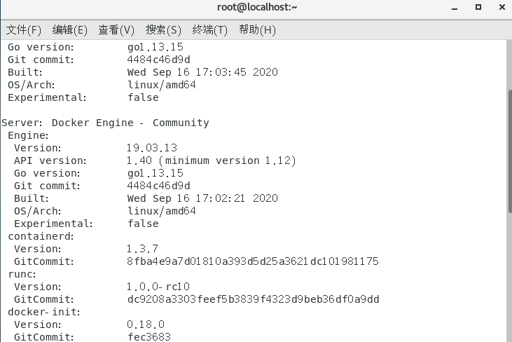

### ***\*1.\*******\*Git/Github的基本操作\****

##### 进入官网注册账号后，新建一个仓库如图

 

 

 

 

##### 通过git命令克隆仓库到本地

 

 

##### 通过git命令进入到仓库

 

##### 新建一个文本文件并编辑

 

 

##### 通过命令git 的add，commit，push上传文件

 

##### 进入仓库可以看到上传的新文件

 

### ***\*2.\*******\*安装JDK1.8与IDEA  ，配置Maven，能够运行一个基于Springboot简单的程序。\****

 

#### 下载JDK

 

官网（http://www.oracle.com/technetwork/java/javase/downloads/index.html）后解压到文件夹

 

进行相关环境变量的配置（JAVA_HOME，PATH，CLASSPATH）

 

#### 下载IDEA

 

官网下在IDEA安装包后安装步骤安装即可（这里早安装...不做展示）

 

 

#### IDEA配置JDK

 

点击File -->Project Structure；

 

点击左侧标签页SDKs选项，再点击左上角“+”，选择Add JDK；

 

在弹出框选择JDK安装路径，点击OK即可配置成功。 

 

下图可以看到JDK已经在IDEA中配置好了。

 

 

 

#### 配置Tomcat

 

官网下载好tomcat后解压压到目录

打开IDEA，RUN→Edit Configurations→Templates→Tomcat Server，选择tomcat路径配置即可

 

 

 

配置Maven

下载完之后解压到你想要存放的文件夹如图：


然后配置path环境变量,如图

新建变量MAVEN_HOME

 

***\*path:\****


配置好后一路确定保存就行。


按 win + R 输入cmd
然后输入 mvn -version
如果跳出版本信息说明安装成功！
如图：

 

Maven配置

目前Maven安装已经完毕，接下来就是配置问题，光安装不配置是不行的。

新建一个本地仓库文件夹，如图


打开settings.xml，位置目录如下图：

 

打开之后在此处加上这么一句指定本地仓库 

 

 

指定阿里云作为我们的中央仓库，下载东西会快很多。

设置jdk版本为1.8

 

在IDEA中修改Maven的地址，如图所示地址修改成个人的安装目录即可。

 

#### 创建能够运行一个基于Springboot简单的程序

File右击新建项目选择Maven，如下图所示，然后点击“Next”

 

 

输入GroupId，Project name和ArtifactId，然后点击“Next”，如下图所示：

 

 

在pom.xml文件中，添加关于maven的依赖，如下图所示：

 

9、此时会进行maven依赖的下载，如下图所示：

 

 

在src/main/java目录上右键，创建一个Class类，如下图所示，在类中添加如下图代码，如下图所示：

 

14、我们在上面创建的命名空间上右键创建一个Class类，如下图所示：

 

 

右键选择“Run HelloApplication”，启动后内置的Tomcat服务器也同时启动起来了，如下图所示：

 

在浏览器中输入localhost:8080/hello，就可以访问到我们先前创建的第二个控制器类中的方法并输出内容到浏览器中显示，如下图所示：

 

 

 

 

 

 

 

### ***\*3.\*******\*通过开发环境IDEA配置Git和GitHub，通过IDEA实现仓靠的Fork, Add，Commit,Push。\****

##### 设置git.exe路径

File-->Settings-->Version Control-->Git

 

 

 

选择GitHub

 

 

 

 

 

##### 从GitHub上clone

File ->New->Project from Version Control

 

 

设置GitHub地址以及存储路径

 

 

点击Clone

 

 


 

#####  提交项目到本地仓库/远程仓库

添加新增文件(git add)

 

 

提交文件按 VCS-->Git-->Commit Changes

 

 

 

 

 

 

 

 

 

 

push成功

 

 

 

 

### ***\*4.\*******\*学习搭建虚拟机，利用VMWare搭建CentOS环境，能够和Windows机器共享资源，掌握基本命令的使用，能够搭建Docker服务器\*******\*。\****

#### 安装虚拟机，搭建CentOS环境

1、下载

**VMware Workstation15**
官方下载地址： [https://www.vmware.com/cn/products/workstation-pro/workstation-pro-evaluation.html](https://www.vmware.com/cn/products/workstation-pro/workstation-pro-evaluation.html)


CentOS7镜像下载：阿里云站点：[http://mirrors.aliyun.com/centos/7/isos/x86_64/](http://mirrors.aliyun.com/centos/7/isos/x86_64/)


VMware Workstation激活码 可以网上搜索*

2、VMware安装

，直接点击下一步即可。

完成结果：


怎么判断是否安装成功呢？


还有就是这里：


3、在虚拟机上安装CentOS7镜像

1、点击上图的创建虚拟机，开始新建

2、这里选择自定义，典型都可，我这里选择典型比较方便


3、这里我们选择“稍后安装操作系统”，然后下一步


4、这个地方是根据你的操作系统进行选择的，这里客户机操作系统选择Linux，版本选择“CentOS7”，点击下一步


5、对系统进行命名，以及选择虚拟机存储位置（建议不要放在系统盘）


6、这里默认就行


7、选择自定义硬件


8、内存，处理器需要更具个人的电脑配置就可以（**建议内存一般在2G以上**，电脑配置好的，内存，处理器数量可以往上调）


9、右边选择使用ISO映像文件，此时选择我们下载好的镜像文件的路径


10、打印机以及我们不需要的配置可以进行移除


11、其余默认就行，网络适配器选择NAT，最后检查一遍，点击关闭，完成即可


12、开启虚拟机


13、点击进入


14、进入这个界面之后，选择中文简体，点击继续


15、更改四个内容，如果想有界面就按照图上所示，没有界面就选择最小安装


16、确认后，点击开始安装


17、设置root密码和普通用户


18、root密码设置


19、完成后，进行重启


20、重启后界面如下图，接受许可


21、许可页面


22、打开连接网络


23、完成后，点击完成配置，我这里有创建用户，是因为之前没有创建


24、选择汉语


25、设置时区


26、开始使用吧


28、选择账户登录


29、登陆成功页面


30、查看ip


---

4、安装VMware Tools

用途：方便在Windows和Linux图形化界面间传输资料！

安装步骤：

在主机上，从 Workstation Pro 菜单栏中选择**虚拟机** > **安装 VMware Tools**。

如果安装了早期版本的 VMware Tools，则菜单项是 **更新 VMware Tools**。

详细安装步骤：[在 Linux 虚拟机中手动安装或升级 VMware Tools](https://docs.vmware.com/cn/VMware-Workstation-Pro/12.0/com.vmware.ws.using.doc/GUID-08BB9465-D40A-4E16-9E15-8C016CC8166F.html#GUID-08BB9465-D40A-4E16-9E15-8C016CC8166F)

---

5、配置联网

5.1 联网概述

目的：

1. Windows可以和Linux虚拟机通信
2. 虚拟机可以和Windows通信
3. 虚拟机可以访问外网

理论：虚拟机的网卡的配置模式

- 桥接模式：网段相同 真实主机：192.168.1.XXX，虚拟主机：192.168.1.XXX，别人能访问你的虚拟机的
- NAT模式：虚拟机处于一个独立的网段，物理机位于一个可以上网的子网段！虚拟机通过网关的配置，连接物理机的物理网卡，通过物理机的网卡上网！只有当前的物理机，才能访问虚拟机，别人不可以。
- 仅主机模式：相似于NAT模式，但不能访问外网

5.2 NAT模式联网

1.选择编辑-->虚拟网络编辑器,更改root用户


2.选择NAT模式，设置子网IP与网关IP


**注：如果一切配置完后，不能ping通，就再改一下子网IP的第三位。**

3.CenOS7设置网络


4.如下图，进行下一步


5.点击设置后，如下图进行操作


6.最重要的一步，根据下图进行配置


5.3 测试联网

linux查看网卡信息：ifconfig

windows查看网卡信息：ipconfig

1. 虚拟机可以访问外网
2. 虚拟机可以和Windows通信


​	3.Windows可以和Linux虚拟机通信


- 从图形化界面切换到命令行模式：`ctrl+alt+F2`
- 从命令行模式切换到图形化界面：`ctrl+alt+F1`

---

6、克隆虚拟机

1.首先要关闭虚拟机

~~~shell
halt    #立马关机
~~~

2.选中要克隆的虚拟机，右击管理---克隆


3.选中要克隆的虚拟机的状态


4.选择克隆类型，一般选择完整克隆虚拟机


5.更改虚拟机的名称和放置虚拟机的位置（一般放在统一目录下，方便管理）


6.点击关闭，完成基本克隆


7.更改虚拟机的当前使用的mac地址和IP地址

- 开机发现mac地址一样，会自动生成新的mac地址和IP地址

- 或者虚拟机右击设置，也可生成新的mac地址；图形化界面也可以改变IP地址

- 

- 

- 用命令行来修改

  - ~~~shell
    vim /etc/sysconfig/network-scripts/ifcfg-ens33 
    ~~~

  - ~~~xml
    TYPE=Ethernet
    PROXY_METHOD=none
    BROWSER_ONLY=no
    BOOTPROTO=none
    DEFROUTE=yes
    IPV4_FAILURE_FATAL=yes
    IPV6INIT=yes
    IPV6_AUTOCONF=yes
    IPV6_DEFROUTE=yes
    IPV6_FAILURE_FATAL=no
    IPV6_ADDR_GEN_MODE=stable-privacy
    NAME=ens33
    UUID=b38fce9a-149b-442c-a433-e8e6b8471b77
    DEVICE=ens33
    ONBOOT=yes
    IPADDR=192.168.10.12    把上面的更改到这里就好啦
    PREFIX=24
    GATEWAY=192.168.10.2
    DNS1=192.168.10.2
    IPV6_PRIVACY=no
    HWADDR=00:0c:29:06:eb:e4	这里也要改啊
    ~                
    
    最后 :wq 保存退出
    
    ~~~

8.修改主机名


9.一切修改完之后，执行下面这个命令

~~~shell
[root@localhost ~]# reboot
~~~

10.好啦，克隆都完成啦！看看能不能ping通


8、配置主机名的hosts文件映射

Linux：在 /etc/hosts 文件中配合

Windows：在C:\windows\System32\drivers\etc\hosts 文件中配置

~~~shell
[root@CentOS72020clone ~]# vim /etc/hosts
~~~


~~~shell
[root@CentOS72020clone ~]# ping CentOS72020
~~~

这样通过主机名解析到IP地址就可以连接上啦！

#### 在CentOS上安装Docker

docker官方文档：[https://docs.docker.com/engine/install/centos/](https://docs.docker.com/engine/install/centos/)

**操作系统要求**

- CentOS 7
- CentOS 8
- 更高版本...

**卸载旧版本**

较旧的Docker版本称为`docker`或`docker-engine`。如果已安装这些程序，请卸载它们以及相关的依赖项。

```shell
$ sudo yum remove docker \
                  docker-client \
                  docker-client-latest \
                  docker-common \
                  docker-latest \
                  docker-latest-logrotate \
                  docker-logrotate \
                  docker-engine
```

如果`yum`报告未安装这些软件包，则可以。Docker Engine软件包现在称为`docker-ce`。

使用存储库安装

在新主机上首次安装 Docker Engine-Community 之前，需要设置 Docker 仓库。之后，您可以从仓库安装和更新 Docker。

**设置存储库**

安装`yum-utils`软件包（提供`yum-config-manager` 实用程序）并设置稳定的存储库。

```shell
$ sudo yum install -y yum-utils

$ sudo yum-config-manager \
    --add-repo \
    https://download.docker.com/linux/centos/docker-ce.repo
```

**安装DOCKER引擎**

安装*最新版本*的Docker Engine和容器

```bash
$ sudo yum -y install docker-ce docker-ce-cli containerd.io
```

**启动 Docker**

```bash
$ sudo systemctl start docker


```


~~~bash
ps -ef|grep docker  #查看docker是否启动
docker version      #查看
~~~




**通过运行 hello-world 映像来验证是否正确安装了 Docker Engine-Community **

```bash
$ sudo docker run hello-world

```

---


 
